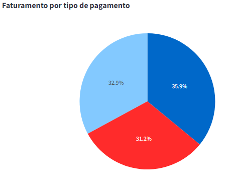
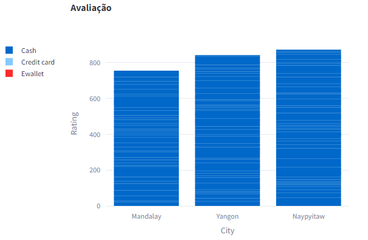

##  INFORMAÇÕES EXTRAS (PT/BR)

# Dasboard Python usando as bilbiotecas 
import streamlit as st
import pandas as pd

 criando os graficos com o plotly
 import plotly.express as px

Criando Dashboard em Python

# Comando básico da biblioteca streamlit
Python -m streamlit run dasboard.py

# Exibindo os dados do CSV

Criando uma sidebar e filtrando os dados pelo meses

Gráfico que exibi o faturamento por dia 

Exibindo o faturamento por Filial

Exibir  o Faturamento por tipo de Produto

Exibir o Faturamento por Filial

Exibir o faturamento por tipo de pagamento

Exibir a avaliação total 

**Fonte: Asimov Academy - Criando Dasboard com Python*

 

##  TECNOLOGIAS UTILIZADAS NO DESENVOLVIMENTO DO PROJETO

 

 
 
 
 
 
 

 
